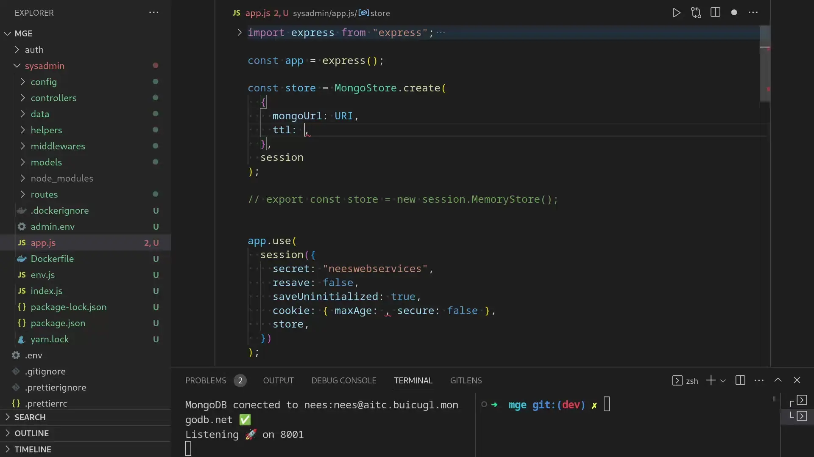
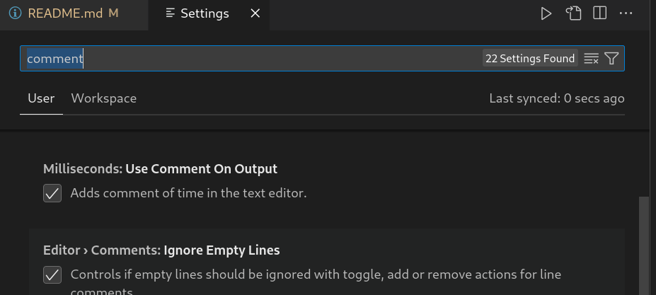

<h1>Millisecond</h1>

Millisecond is a VSCode extension that allows you to convert time prompts into milliseconds and automatically write the result. This is especially useful for developers who frequently work with timeouts, intervals, and animations.

 

**Features**

- Supports a wide range of time units, with intelligence.
- Easy to use: simply select the time prompt and trigger command 'use milliseconds'.
- Lightweight and fast: designed to be unobtrusive and efficient.
- Shift + Alt + N shortcut key to direct open.
- You can turn off **auto comment** of time in setting. 'use comment on output'

 

 

Example prompts 🚀 :

- 1 year 2 mon 3 week 4 day 15hr 5minute 9sec
- 4 year 3mon 6 week and 3 days

### 1.0.0

Publish release of Milliseconds LTS to v1.

## License

Millisecond is licensed under the MIT License. See the [LICENSE](LICENSE) file for details.

## Credits

Millisecond is created by Nischal Dahal and is maintained by neeswebservices Inc. If you have any feedback or suggestions, please feel free to [contact us](mailto:neeswebservice@gmail.com) or [submit an issue](https://github.com/neeswebservices/use-millisecond/issue) on GitHub.
